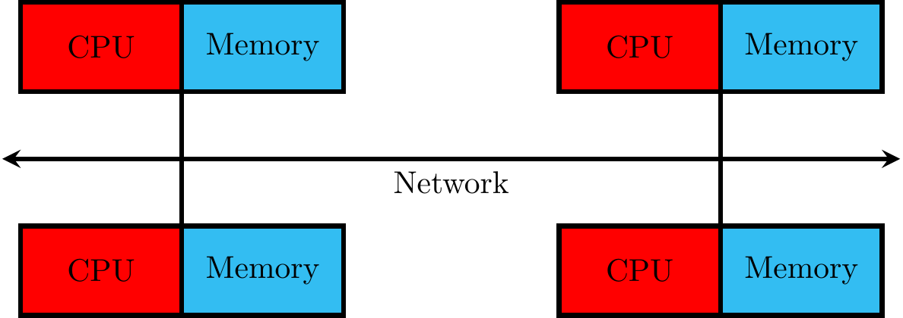
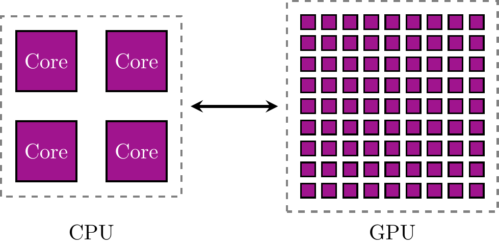

As with any other computer, an HPC system can be used with sequential programming. This is the practice of writing computer programs executing one instruction after the other, but not instructions simultaneously in parallel, i.e., parallel programming.

## Parallel programming

There are different ways of writing parallelized code, while in general there is only one way to write sequential code, generally as a logic sequence of steps.

## OpenMP (multithreading)

A popular way of parallel programming is through writing sequential code and pointing at specific pieces of code that can be parallelized into threads (fork-join mechanism, see figure below from [ADMIN magazine](https://www.admin-magazine.com/var/ezflow_site/storage/images/media/images/pymp_01/172579-1-eng-US/Pymp_01_reference.png)). A thread is an independent execution of code with its own allocated memory.

If threads vary in execution time, when they have to be joined together to collect data, some threads might have to wait for others, leading to loss of execution time. It is up to the programmer to best balance the distribution of threads to optimize execution times when possible.

Modern CPUs support openMP in a natural way, since they are usually multicore CPUs and each core can execute threads independently. OpenMP is available as an extension to the programming languages C and Fortran and is mostly used to parallelize for loops that constitute a time bottleneck for the software execution.

| Link :link:      | Description                          |
| :---------- | :----------------------------------- |
| [Video course](https://www.youtube.com/watch?v=2GwZKJ4QpME)       | a video course (here the link to the first lesson, you will be able to find all the other lessons associated to that) held by  ARCHER UK. |
| [OpenMP Starter](https://chryswoods.com/beginning_openmp/)      | A starting guide for OpenMP |
| [WikiToLearn course](https://en.wikitolearn.org/Course:Parallel_programming_with_OpenMP_and_MPI)      | An OpenMP course from WikiToLearn |
| [MIT course](https://ocw.mit.edu/courses/earth-atmospheric-and-planetary-sciences/12-950-parallel-programming-for-multicore-machines-using-openmp-and-mpi-january-iap-2010/)      | A course from MIT including also MPI usage (next section for more info about MP) |

## MPI (message passing interface)

MPI is used to distribute data to different processes, that otherwise could not access to such data (figure below inspired by [LLNL](https://hpc-tutorials.llnl.gov/mpi/what_is_mpi/)). 

MPI is considered a very hard language to learn, but this reputation is mostly due to the fact that the message passing is programmed explicitly.

| Link :link:  | Description                          |
| :---------- | :----------------------------------- |
| [Video course](https://www.youtube.com/watch?v=R5rIoAkEJBE)       | a video course (here the link to the first lesson, you will be able to find all the other lessons associated to that) held by  ARCHER UK. |
| [MPI Starter](https://chryswoods.com/beginning_mpi/)      | A starting guide for OpenMP |
| [PRACE course](https://www.futurelearn.com/info/courses/python-in-hpc/0/steps/65139)      | A PRACE course on the MOOC platform FutureLearn |

## GPU programming

GPUs (graphical processing units) are computing accelerators that are used to boosts heavy linear algebra applications, such as deep learning. A GPU usually features a large number of special processing units that enable massively parallel execute of code (figure below inspired by [Astronomy Computing Today](https://astrocompute.files.wordpress.com/2011/03/gpu-computing-feature.jpg)).

When utilized properly GPUs can enable performance of certain programs that is unachievable using only CPUs. To achieve this performance GPUs employ an architecture that is vastly different from that of a CPU which is illustrated below (figure inspired by [omisci](https://www.omnisci.com/technical-glossary/cpu-vs-gpu)), where ALU is an acronym for arithmetic logic unit.

For the sake of clarity text is omitted in parts of the figure with the different parts indicated by their colour code.

When writing programs that utilize GPUs the different architecture of a GPU poses a different set of challenges compared to those of writing parallel programs for CPUs. Specifically as memory on GPUs is limited compared to CPUs a different approach to memory management is required.

AMD and Nvidia are the two main producers of GPUs, where the latter has dominated the market for a long time. The Danish HPCs Type 1 and 2 feature various models of Nvidia graphic cards, while Type 5 (LUMI) has the latest AMD Instinct.

The distinction between AMD and Nvidia is mainly due to the fact that they are programmed with two different dialects, and software with dedicated multithreading on GPUs need to be coded specifically for the two brands of GPUs.

### Nvidia CUDA

`CUDA` is a `C++` dialect that has also various library for the most popular languages and packages (e.g. `Python`, `PyTorch`, `MATLAB`, ...).

| Link :link:   | Description                          |
| :---------- | :----------------------------------- |
| [Nvidia developer training](https://developer.nvidia.com/cuda-education-training)       | Nvidia developer trainings for `CUDA` programming |
| [Book archive](https://developer.nvidia.com/cuda-books-archive)      | An archive of books for `CUDA` programming |
| [Advanced books](https://bookauthority.org/books/new-cuda-books)      | Some advanced books for coding with `CUDA` |
| [PyCUDA](https://developer.nvidia.com/how-to-cuda-python)      | Code in `CUDA` with python |

### AMD HIP

HIP is a dialect for AMD GPUs of recent introduction. It has the advantage of being able to be compiled for both AMD and Nvidia hardware. `CUDA` code can be converted to HIP code almost automatically with some extra adjustments by the programmer.

The LUMI HPC consortia has already organized a course for HIP coding and CUDA-to-HIP conversion. Check out their page for new courses.

| Link :link:       | Description                          |
| :---------- | :----------------------------------- |
| [Video introduction 1](https://www.youtube.com/watch?v=3ZXbRJVvgJs)       | Video introduction to HIP |
| [Video introduction 2](https://www.youtube.com/watch?v=57FwfePRd-Y)      | Video introduction to HIP |
| [AMD programming guide](https://rocmdocs.amd.com/en/latest/Programming_Guides/Programming-Guides.html)      | Programming guide to HIP from the producer AMD |
